## 简介

本系统基于Spring Boot架构，采用了现代的Web开发技术，使用B/S架构、前后端分离的开发模式，前端采用Vue.js框架开发，后端使用Spring Boot框架，提供数据请求和业务逻辑的实现，使用MyBatis-plus框架简化对数据库的操作，使用MySQL进行数据存储。
系统用户分为三类：管理员、教师、学生。本系统实现了学生平时成绩的录入、查询、修改、删除等功能，支持教师对课程平时成绩的管理，平时成绩的统计与分析。同时，系统还提供了平时成绩信息的导出功能，方便教师和学生进行成绩查看和成绩分析。

## 使用

开发环境

 

- `Visual Studio Code`
- 安装 `.vscode/extensions.json` 文件中推荐的插件
- `node` 20.x 或 22+
- `pnpm` 9+

## 系统功能

**用户管理**：登录、登出、修改密码

**权限管理**：页面级权限（动态路由）、路由守卫

**多环境**：开发环境（development）、预发布环境（staging）、生产环境（production）

**首页**：根据不同用户显示不同的页面

**导入导出**：可以导入或导出相应的excel文件

## 技术栈

# 前端：

**Vue3**

**Element Plus**

**Pinia**

**Vite**

**Vue Router**

**TypeScript**

**Axios**

**ECharts**

**pnpm**

**ESlint**

# 后端：

**Java17**

**SpringBoot v3.3.5**

**MyBatis-Plus v3.5.6**

**Sa-Token v1.38.0**

**easyExcel v4.0.3**

# 数据库：

**MySQL8.0**

## 系统运行截图

# 管理员

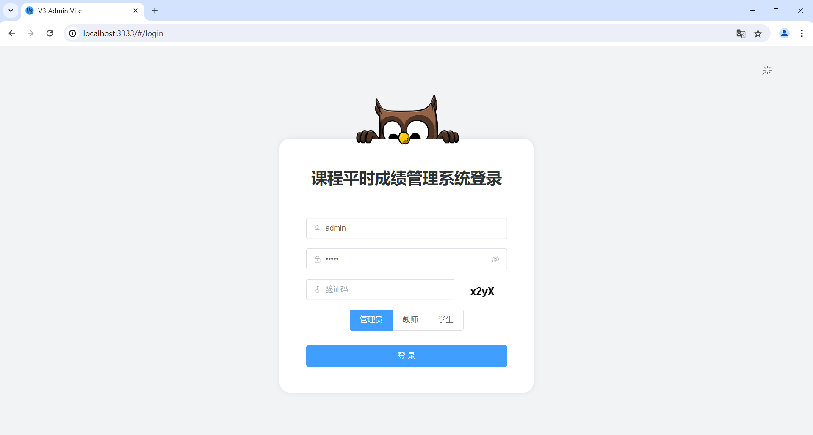

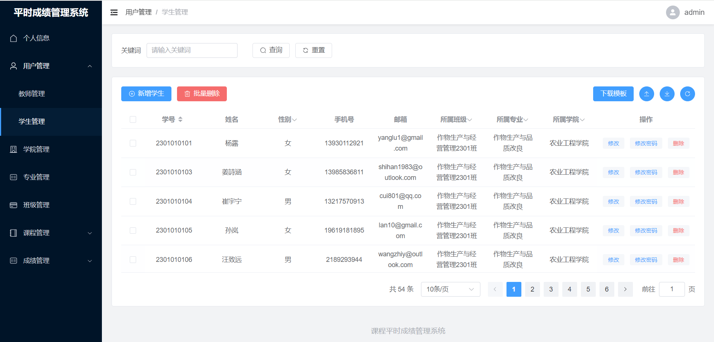

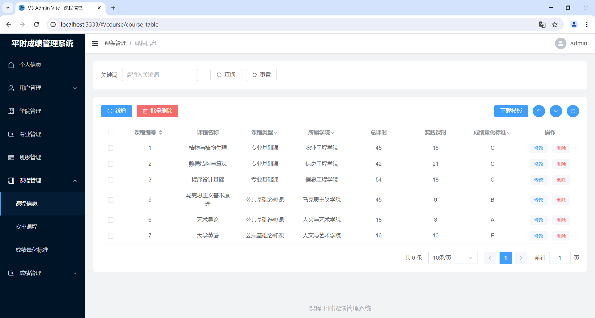

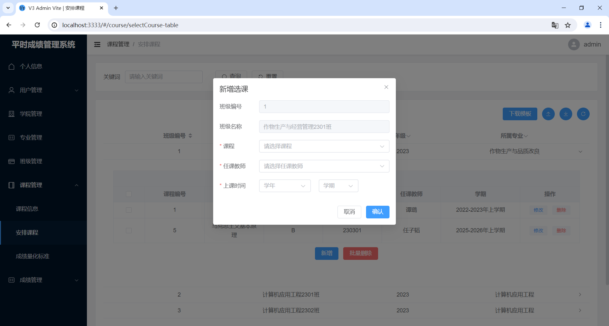

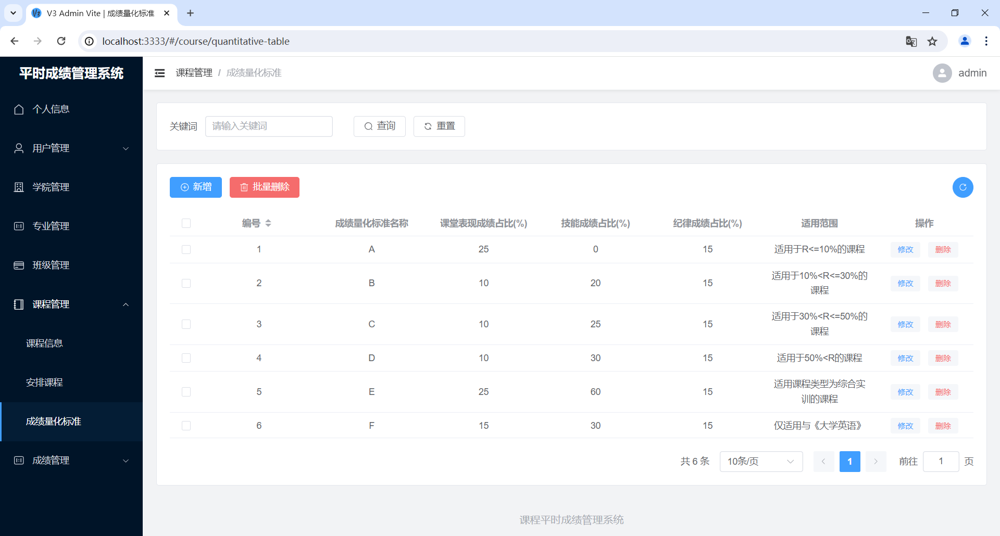

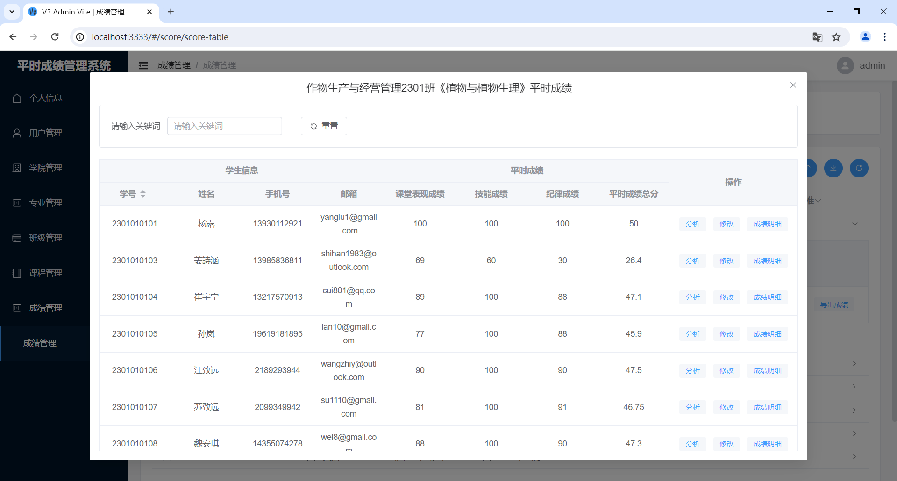

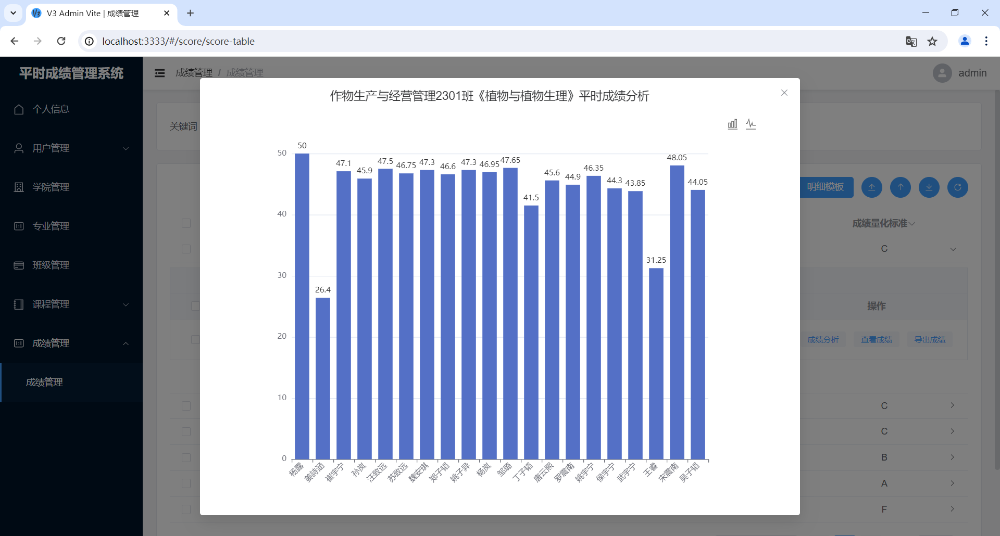

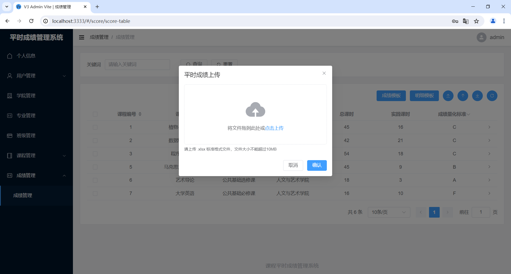

#学生

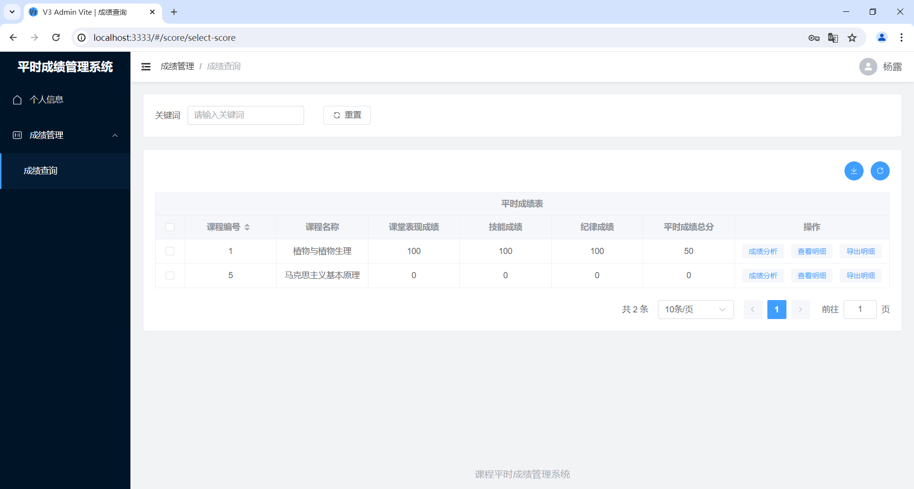

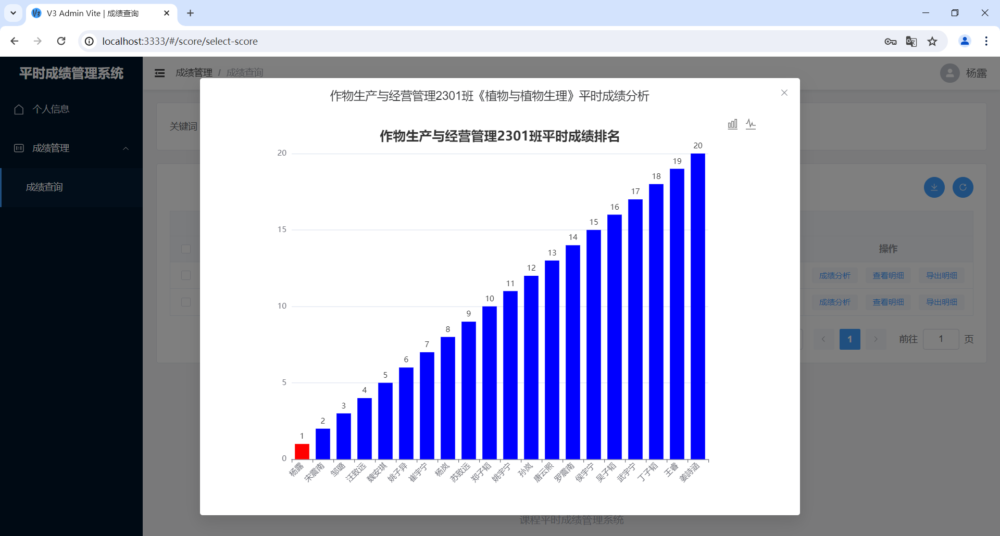

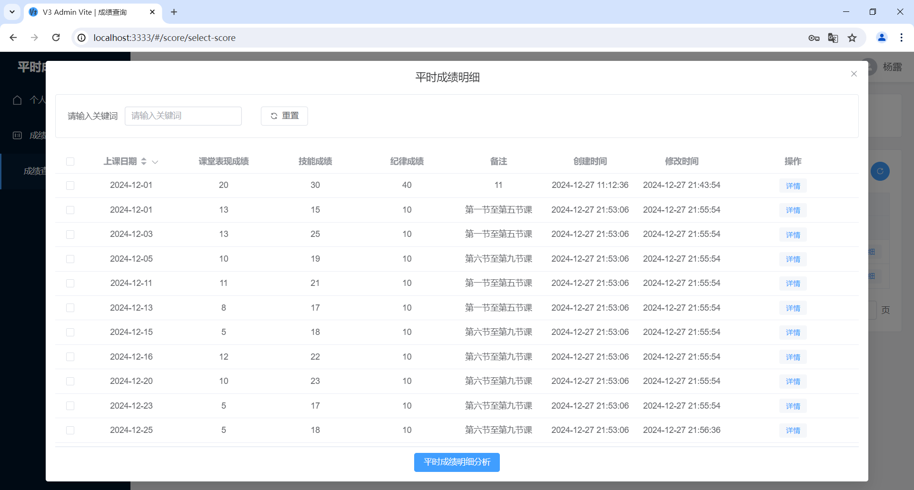